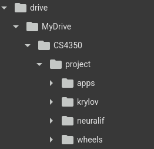

# GML-Project

## Project Setup

1. Download the Jupyter Noteboook from the [notebook folder](/notebook/Scalable_NeuralIF.ipynb) and open it in Google Colab
2. Get the python files from [NeuralIF's GitHub Repo](https://github.com/paulhausner/neural-incomplete-factorization/tree/main)
3. Install [numml build wheel](./setup/numml-0.1.0-cp311-cp311-linux_x86_64.whl) and place it in a directory called `wheels/`. Alternatively, build the wheel from within Colab (following the instructions, takes ~7 mins)
4. Upload the files to your Google Drive. Recommended file structure (as required in project) is:

5. Follow the instructions in the Notebook to run the code
